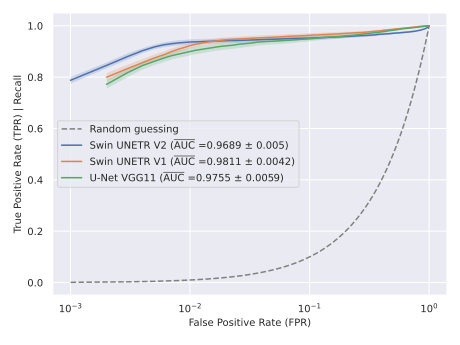

# Swin UNETR for Spatio-Temporal Semantic Segmentation in Active Infrared Thermography

This repository contains the implementation of the codebase developed for the master's thesis:

**_Spatiotemporal Transformer Approach for Semantic Segmentation in Internal Defect Detection using Active Infrared Thermography_**

**Author**: Adrián de Miguel Palacio  
**Degree**: M.Sc. Data Science  
**Institution**: Institut für Informatik und Computational Science, Universität Potsdam, Germany  
**Year**: 2025

---

## 🧠 Overview

This thesis introduces and evaluates a novel end-to-end spatio-temporal deep learning framework for detecting internal defects using **Active Infrared Thermography (AIRT)**. The proposed method is based on a **3D transformer architecture (Swin UNETR)**, adapted to process thermal image sequences directly without relying on traditional video-to-image preprocessing techniques.

The codebase also includes a benchmark against a common 2D spatial deep learning approach: **U-Net with a VGG11 backbone**, using **Principal Component Thermography (PCT)** and **Pulsed Phase Thermography (PPT)** for video-to-image preprocessing.

---

## 🧩 Models

### 🔷 Proposed Approach: Swin UNETR

- Fully end-to-end 3D spatio-temporal transformer-based segmentation
- Tiled spatial inputs + temporal subsampling
- Two variants tested:
  - **V1**: 3D logit compression at the output
  - **V2**: Temporal compression integrated in skip connections

### 🔶 Baseline: U-Net VGG11

- 2D segmentation on summary images created with video-to-image processing
- Evaluated using both **PPT** and **PCT**

---

## 🧪 Evaluation Protocol

- **Model selection/hyperparamter tuning** was based on **Bayesian hyperparameter optimization** using the **Optuna** framework.
  - Separate tuning was performed for each model variant using a **hold-out validation set** (15% of samples).
  - The optimization objective was **minimization of validation loss**, with early stopping and memory-safe pruning (CUDA OOM-aware).
  - The best hyperparameter configuration found during tuning was used for evaluation in a 5-fold cross-evaluation scheme.

- **Evaluation setup**: Hold-out validation (same set used in hypertuning) + 5-fold cross-evaluation for robust performance estimation.

- **Performance metrics** (@0.5 when evaluated at a fixed classification threshold of 0.5):
  - **IoU@0.5 (Intersection over Union)**: Measures the overlap between predicted and true defect regions.
  - **F1-Score@0.5 (Dice Coefficient)**: Harmonic mean of precision and recall for defective areas.
  - **TPR@0.5 (True Positive Rate / Recall)**: Percentage of actual defective pixels correctly identified.  
  - **FPR@0.5 (False Positive Rate)**: Percentage of non-defective pixels incorrectly classified as defective.  

- **Statistical testing for significance**:
  - **Shapiro–Wilk test** to assess normality of metric differences across folds.
  - **Paired one-tailed t-tests** to compare whether one model significantly outperforms another.

- **Complexity metrics**:
  - **FLOPs**: Approximate computational cost per forward pass.
  - **# Parameters**: Total number of trainable weights in the model.
  - **Training time / Inference time**: Runtime performance per training split and per sample respectively.

---

## 📊 Results Summary

### 📈 ROC Curve Comparison

The following figure presents the average ROC curves across evaluation folds for the two proposed Swin UNETR variants (V1 and V2) and the baseline U-Net VGG11 model. 

While Swin UNETR V1 achieves the highest mean ROC AUC overall, Swin UNETR V2 demonstrates superior performance in the low false positive rate (FPR) region, which is especially relevant in critical applications like defect detection.

---

| Model             | IoU@0.5 (mean / std) | F1-Score@0.5 (mean / std)  | TPR@0.5 (mean / std)  | FPR@0.5 (mean / std)  |
|-------------------|----------------------|----------------------------|-----------------------|-----------------------|
| **Swin UNETR V1** | 0.7504 / 0.0417      | 0.8526 / 0.0304            | 0.8384 / 0.0413       | 0.0031 / 0.0008       | 
| **Swin UNETR V2** | 0.7887 / 0.0348      | 0.8794 / 0.0233            | 0.8709 / 0.0447       | 0.0027 / 0.0010       | 
| **U-Net VGG11**   | 0.7013 / 0.0417      | 0.8120 / 0.0396            | 0.8179 / 0.0648       | 0.0031 / 0.0011       | 

### 🔍 Statistical Testing Summary

- **Swin UNETR V1 vs V2**:
  - Swin UNETR V2 showed **statistically significant improvements** over V1 in all fixed-threshold metrics: **IoU@0.5**, **F1-Score@0.5**, **TPR@0.5**, and **FPR@0.5**.

- **Swin UNETR V2 vs U-Net VGG11**:
  - V2 **statistically outperformed** U-Net VGG11 in **IoU@0.5** and **F1-Score@0.5**.
  - It also achieved higher **TPR@0.5** and lower **FPR@0.5**, though these improvements were **not statistically significant**.

### ⚙️ Complexity Comparison

| Model             | # Parameters (M) | FLOPs (G) | Avg. Training Time per Fold (h) | Inference Time (s)                  |
|-------------------|------------------|-----------|---------------------------------|-------------------------------------|
| **Swin UNETR V1** | 4.18             | 12.62     | 3.57                            | 3.81                                |
| **Swin UNETR V2** | 117.54           | 244.86    | 5.02                            | 8.87                                |
| **U-Net VGG11**   | 28.32            | 75.84     | 0.72                            | 15.94                               |

